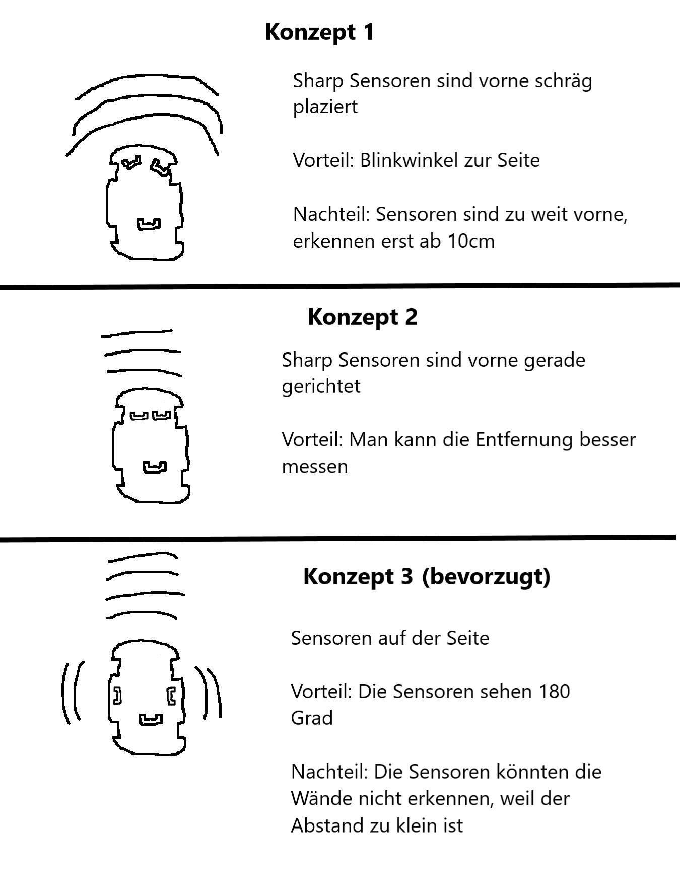

Arbeitspaket 1:  
Vorbereitung  
    
Arbeitspaket 2:    
Aufbau & Verkabelung  
  
Arbeitspaket 3:  
Kalibrieren der Sensoren  
  
Arbeitspaket 4:  
Code erstellen  
  
Arbeitspaket 5:  
Testen der Motoren und Sensoren  
  
Arbeitspaket 6:  
Testfahrt auf der Strecke  
  
Arbeitspaket 7:  
Fehlersuche & Behebung  

  
