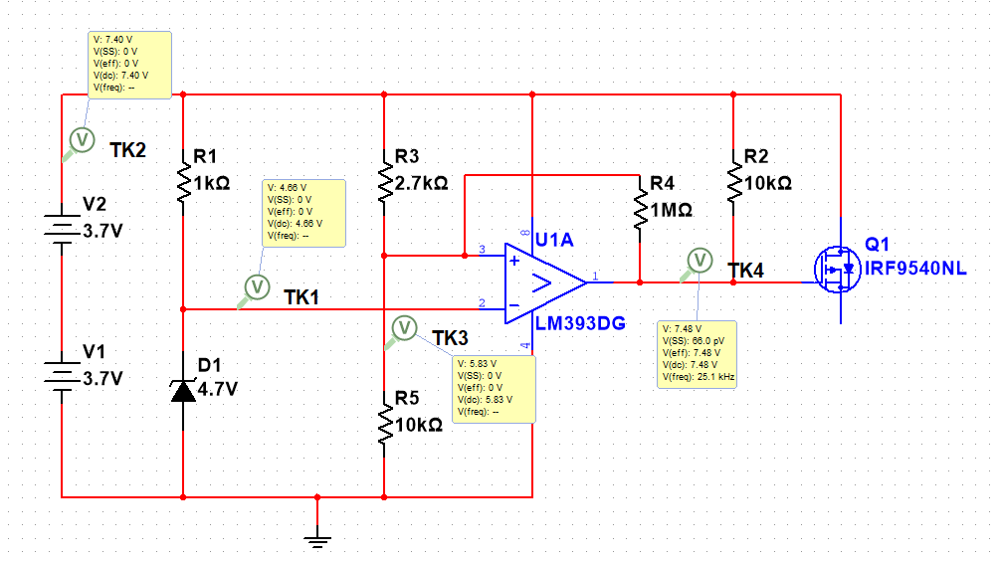

# Schutzschaltung gegen Tiefentladung

Die vorliegende Schutzschaltung dient dazu, ein Akkupack aus zwei 18650-Li-Ion-Zellen vor einer schädlichen Tiefentladung unter 6,0 V zu bewahren. 
Die Schaltung verwendet den Komparator LM393, der die aktuelle Akkuspannung über einen Spannungsteiler (R3, R5) ständig mit einer stabilen Referenzspannung vergleicht, die durch eine 4,7 V Z-Diode (D1) bereitgestellt wird.
Solange die Akkuspannung im sicheren Bereich liegt, steuert der Komparator das Gate des P-Kanal-MOSFETs (IRF9620) so an, dass dieser leitet und den Stromfluss zum Verbraucher ermöglicht. 
Sinkt die Gesamtspannung jedoch unter den kritischen Schwellenwert, kippt der Ausgang des Komparators und sperrt den MOSFET, wodurch die Last zuverlässig vom Akku getrennt wird. 
Um ein instabiles Schaltverhalten bei minimalen Spannungsschwankungen zu verhindern, ist die Schaltung durch den Widerstand R4 als Schmitt-Trigger ausgelegt. 
Dies sorgt für eine notwendige Hysterese, sodass der Akku nach der Abschaltung erst wieder eine deutlich höhere Spannung erreichen muss, bevor der Laststromkreis erneut geschlossen wird.

  

Es wurde ein IRF9620 verwendet, dieser ist allerdings nicht in Multisim erhältlich, weshalb stattdessen ein IRF9540NL in der Schaltung zu sehen ist.
